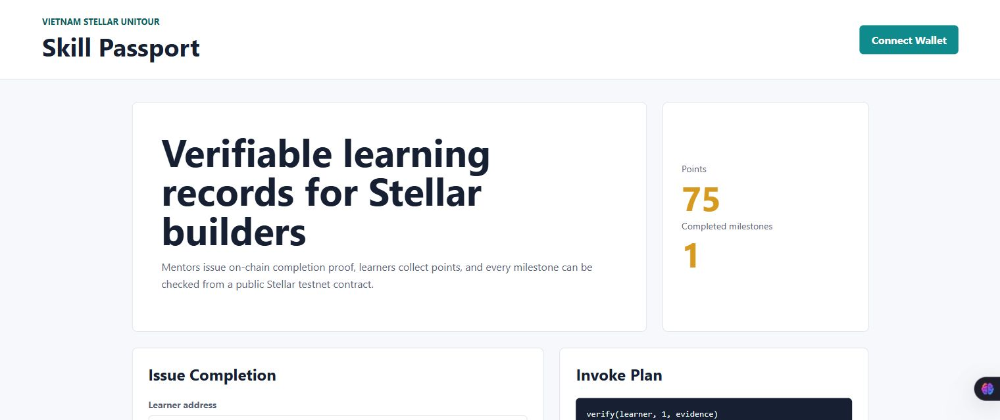

# Skill Passport on Stellar

## Project Description

Skill Passport is my Stellar Soroban project for the Vietnam Stellar Unitour. The idea is simple: when a student finishes a course, workshop, or project milestone, a trusted verifier can record that achievement on-chain

I chose this idea because many learning records are still kept in private forms, screenshots, or spreadsheets. With this contract, a learner can have a small public "passport" that shows completed milestones, earned points, and a link to proof such as a GitHub repository or demo

## Project Vision

My vision is to make learning progress easier to prove and reuse. A student should not have to explain the same achievements again and again when joining another bootcamp, hackathon, or student builder group. If the records are stored on Stellar, communities can check them quickly, and learners can keep building their reputation over time

## Key Features

- Admin can create learning milestones with a title, verifier, and point reward
- Only the selected verifier can confirm a learner's completion
- A learner can only complete the same course once, so duplicate credit is blocked
- The contract stores courses, completion proof, total points, and passport summaries
- Anyone can query a course, check whether a learner completed it, or view a learner passport
- Unit tests cover the main success flow and the duplicate-completion case
- The `frontend/` folder has a small UI prototype with Freighter and Stellar SDK integration points

## Contract Details

Repository: https://github.com/fuocs/stellar-skill-passport

Contract on Stellar Testnet:
https://stellar.expert/explorer/testnet/contract/CBXPT65ICV2ST62OXKKI3CGOTUA3UAB32KBIQJRFR4KJMGHL2MAYQVTU?filter=history

Contract ID:

```text
CBXPT65ICV2ST62OXKKI3CGOTUA3UAB32KBIQJRFR4KJMGHL2MAYQVTU
```

WASM hash:

```text
4b2b6f044ef4397613cf68993f553dc1a27edafc710b27eccf524bab90e96c75
```

Testnet deployer:

```text
GCBZQEMRYZJGQVMJ5GI3ORDLT55UL7V4FCLUWUAEANKV5FBOJHMRZZBX
```

Main testnet transactions:

- Upload WASM: https://stellar.expert/explorer/testnet/tx/951f774a9901e66c04548b9efa72d6016f4f605a2d611b1fd57ce2ded2b79a2d
- Deploy contract: https://stellar.expert/explorer/testnet/tx/98ea51a467aa6c8ff29ddf97d4103fda30c90292df27a8cb2ced7155d2ccf357
- `init`: https://stellar.expert/explorer/testnet/tx/cd3d883fd87ef019571ad599a99e8f8e745b035b697a86ac054b2e8bb6dfdf39
- `create_course`: https://stellar.expert/explorer/testnet/tx/8ac897cd8b4b0d71d483352e66a860f88aedd1affb7ee66826e11597246e3694
- `verify`: https://stellar.expert/explorer/testnet/tx/c903a4ece6ad0c932a93ca370ab3b04ad883497fc71c0338ce4a2a19a76ac946

The `passport` call was read-only and returned:

```json
{"completed":1,"last_course":1,"learner":"GCBZQEMRYZJGQVMJ5GI3ORDLT55UL7V4FCLUWUAEANKV5FBOJHMRZZBX","points":75}
```


## Main Functions

| Function | Purpose |
| --- | --- |
| `init(admin)` | Set the first admin account |
| `create_course(title, verifier, reward)` | Add a new learning milestone |
| `set_course_active(course_id, active)` | Pause or reopen a course |
| `verify(learner, course_id, evidence)` | Record that a learner finished a milestone |
| `passport(learner)` | Show a learner's points, completed count, and latest course |
| `has_completed(learner, course_id)` | Check completion status |
| `get_course(course_id)` | Read course information |
| `get_completion(learner, course_id)` | Read the proof for one completion |

## Local Structure

```text
.
|-- Cargo.toml
|-- contracts
|   `-- skill-passport
|       |-- Cargo.toml
|       `-- src
|           |-- lib.rs
|           `-- test.rs
|-- frontend
|   |-- app.js
|   |-- index.html
|   |-- package.json
|   |-- server.mjs
|   `-- styles.css
|-- contract-history.png
|-- frontend-preview.png
|-- info.md
|-- lib.rs
`-- README.md
```

The root `lib.rs` is included because the bootcamp guide asks us to paste code into a `lib.rs` file in Soroban Studio. The full Rust project is inside `contracts/skill-passport/`

## Setup

For the contract:

```bash
rustup target add wasm32v1-none
cargo test
stellar contract build --package skill-passport
```

For the frontend:

```bash
cd frontend
npm install
npm run dev
```

Then open:

```text
http://127.0.0.1:5173/
```

The frontend uses Freighter for wallet access and the Stellar SDK package for testnet contract integration

## Build and Test

Commands I used to check the contract:

```bash
cargo test
stellar contract build --package skill-passport
```

The test suite currently covers the normal passport flow and the duplicate-completion guard

## Screenshots

Contract history on Stellar Expert:


Frontend UI preview:



## Frontend Preview

The frontend is still a prototype, but it shows how the app could feel for a learner or verifier. It includes a Freighter connect button and prepares the `verify` contract call against the deployed testnet contract

## Deploy and Invoke

This is the flow I used on Stellar Testnet:

1. Build the contract with Stellar CLI
2. Create and fund a testnet deployer
3. Deploy `target/wasm32v1-none/release/skill_passport.wasm`
4. Invoke in this order:

```text
init(admin = deployer address)
create_course(title = "Soroban Smart Contract Basics", verifier = deployer address, reward = 75)
verify(learner = deployer address, course_id = 1, evidence = "https://github.com/fuocs/stellar-skill-passport")
passport(learner = deployer address)
```

For a better demo, I would use two wallets: one mentor wallet as the `verifier`, and one student wallet as the `learner`

## Future Scope

- Turn the current Freighter/Stellar SDK flow into a full signed transaction flow
- Add more verifier roles for clubs, mentors, and partner events
- Add badge levels such as Beginner, Builder, and Hackathon Ready
- Add a way to revoke or dispute a wrong completion record
- Build a small dashboard where people can search learner passports

## About Me

Name: Tran Nguyen Huu Phuoc

I am a student learning how to move from normal web development into web3. Through this project, I practiced Rust smart contracts, Stellar/Soroban basics, GitHub project submission, and a small frontend prototype
